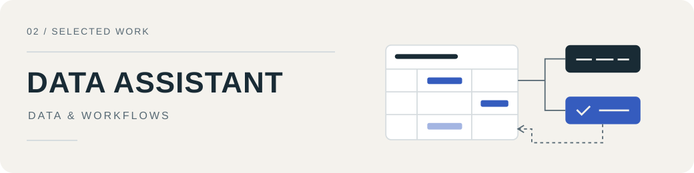

  MEDIA TOOLS &nbsp; / &nbsp; DATA SYSTEMS &nbsp; / &nbsp; BROWSER UTILITIES

  

<h1 align="center">把想法做成能用的工具。</h1>

  写代码，也琢磨流程、界面和那些容易被忽略的细节。 <code>( •̀ ω •́ )✧</code>

  <a href="#user-content-代表项目">代表项目</a> &nbsp; · &nbsp;
  <a href="#user-content-更多作品">更多作品</a>

我主要做影像创作工具、经营数据系统和浏览器扩展。项目大多从日常工作里长出来：一段素材怎么交付，一份报表怎样核对，一连串重复操作能不能少点几次。

我喜欢把这些问题往下做一层。除了界面，还要处理任务调度、数据归属、失败恢复和版本记录；有人接着用时，能看懂它的来龙去脉。

## 代表项目

<h3><a href="https://github.com/h296025733-sys/jingxu-director-workbench">镜序 · AI 影像创作台 ↗</a></h3>

<a href="https://github.com/h296025733-sys/jingxu-director-workbench">
    <picture>
      <source media="(prefers-color-scheme: dark)" srcset="assets/jingxu-dark.svg">
      <source media="(prefers-color-scheme: light)" srcset="assets/jingxu-light.svg">
      
    </picture>
  </a>

把需求、参考素材、创作规划、自动剪辑和交付版本收进同一个任务。从一个人的剪片流程，往多人可用的创作工作台继续做。

  
同用户串行、不同用户轮转；按资源限制并发，记录上传取消与恢复。剪辑计划还保留原片覆盖、质量检查和交付历史，让一次生成有据可查。

  
<code>Next.js</code> <code>TypeScript</code> <code>SQLite</code> <code>Python / FFmpeg</code>

  
<a href="https://github.com/h296025733-sys/jingxu-director-workbench#readme">项目说明</a> &nbsp; · &nbsp; <a href="https://github.com/h296025733-sys/jingxu-director-workbench/blob/main/lib/work-scheduler.ts">任务调度</a> &nbsp; · &nbsp; <a href="https://github.com/h296025733-sys/jingxu-director-workbench/blob/main/lib/video-upload-sessions.ts">上传会话</a>

<h3><a href="https://github.com/h296025733-sys/feishu-data-assistant">飞书经营数据助手 ↗</a></h3>

<a href="https://github.com/h296025733-sys/feishu-data-assistant">
    <picture>
      <source media="(prefers-color-scheme: dark)" srcset="assets/data-dark.svg">
      <source media="(prefers-color-scheme: light)" srcset="assets/data-light.svg">
      
    </picture>
  </a>

在群聊里问经营问题，用可检查的代码执行筛选、求和、去重计数和排名。群聊路由、表格与凭证按店铺分开，模型负责理解提问，计算保留明确口径。

  
写入先形成计划和备份，执行后读回核对；回滚比较当前值与本次写入值，跳过后来被修改的记录。一次更新可以追溯到具体任务和具体字段。

  
<code>TypeScript</code> <code>飞书多维表格</code> <code>多租户</code> <code>任务状态</code>

  
<a href="https://github.com/h296025733-sys/feishu-data-assistant#readme">项目说明</a> &nbsp; · &nbsp; <a href="https://github.com/h296025733-sys/feishu-data-assistant/blob/main/src/query/engine.ts">查询引擎</a> &nbsp; · &nbsp; <a href="https://github.com/h296025733-sys/feishu-data-assistant/blob/main/src/realtime/feishu-video-sync.ts">更新与回滚</a>

<h3><a href="https://github.com/h296025733-sys/tiktok-daren-assistant">TikTok 达人助手 ↗</a></h3>

<a href="https://github.com/h296025733-sys/tiktok-daren-assistant">
    <picture>
      <source media="(prefers-color-scheme: dark)" srcset="assets/browser-dark.svg">
      <source media="(prefers-color-scheme: light)" srcset="assets/browser-light.svg">
      
    </picture>
  </a>

围绕达人主页和当前视频，做筛选、批量下载、评论翻译与字幕整理。把常用操作放在浏览器侧栏，处理结果也跟着当前视频走。

  
动态页面会复用节点，旧请求可能在切换视频后才返回。活动视频会话、字幕缓存和下载队列各自管理状态，减少内容串到另一条视频的机会。

  
<code>Chrome MV3</code> <code>TypeScript</code> <code>浏览器语音识别</code>

  
<a href="https://github.com/h296025733-sys/tiktok-daren-assistant#readme">项目说明</a> &nbsp; · &nbsp; <a href="https://github.com/h296025733-sys/tiktok-daren-assistant/blob/main/extension/src/content/session.ts">活动视频会话</a>

## 更多作品

### 影像与内容分析

| 项目 | 我主要在处理什么 |
| --- | --- |
| [TikTok 达人商业内容分析](https://github.com/h296025733-sys/tiktok-creator-intelligence) | 商业披露、挂链与推断分开；播放量与账号自身基线比较；复核绑定到本轮视频证据。 |
| [Auto Video Lab](https://github.com/h296025733-sys/codex-auto-video-lab) | JSON 剪辑单先校验、再渲染；解码、音视频指标和抽帧形成质量报告，也是镜序的媒体处理基础。 |
| [Seedance 视频导演工作台](https://github.com/h296025733-sys/seedance-director-workbench) | 将参考片的动作、镜头、声音和时间轴证据整理成分镜约束、素材职责与执行包。 |

<b>数据与运营工具 · 展开查看</b>

| 项目 | 设计重点 |
| --- | --- |
| [TikTok Shop 数据管线](https://github.com/h296025733-sys/tiktok-shop-data-pipeline) | 只读 API 与报表标准化；精确端点白名单、快照哈希、分页与能力状态。 |
| [FastMoss 本地数据目录](https://github.com/h296025733-sys/fastmoss-local-catalog) | 让原始页、SQLite 索引、图片与导出之间的对应关系和缺口可以核对。 |
| [渠道内容运营台](https://github.com/h296025733-sys/channel-ops-workbench) | 将店铺、账号、内容标识、制作阶段与排期放进同一套数据关系和矩阵界面。 |

<b>浏览器与桌面工具 · 展开查看</b>

| 项目 | 解决的问题 |
| --- | --- |
| [商品素材助手](https://github.com/h296025733-sys/amazon-tiktok-shop-media-downloader) | 识别当前商品与 SKU，排除评论和推荐图，归并图片版本并分类下载。 |
| [轻存 · TikTok 下载器](https://github.com/h296025733-sys/qingcun-tiktok-downloader) | Windows 下载队列、文件整理、系统代理与逐项失败处理。 |
| [抖音下载与口播字幕](https://github.com/h296025733-sys/douyin-download-subtitles) | 当前视频绑定、平台字幕预览与带时间戳的 SRT 导出。 |

<b>早期项目 · 展开查看</b>

- [telecom-bid-scout-lite](https://github.com/h296025733-sys/telecom-bid-scout-lite)：通信招采线索接入、规则评分、可解释报告与飞书通知。
- [ai-xhs-video-workflow-mvp](https://github.com/h296025733-sys/ai-xhs-video-workflow-mvp)：短视频采集、BGM 替换与自动化调度工作流 MVP。

---

项目 README 包含运行入口、设计说明与实际检查范围。顶部为主题插画，三幅项目配图为结构示意。
